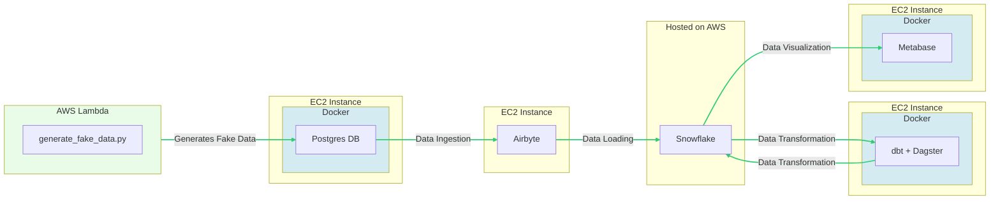

# RetailFlow

## Description

RetailFlow is a comprehensive ELT (Extract, Load, Transform) project designed to simulate the flow of retail sales data for an e-commerce platform. The infrastructure is provisioned and managed on AWS, with each service optimized for its specific role in the pipeline.

The data simulation is handled by a Python script executing within an AWS Lambda function. The generated data is then pushed to a PostgreSQL database instance deployed on AWS EC2.

Data is ingested using Airbyte into the data warehousing solution, Snowflake. Airbyte operates on its own EC2 instance, ensuring dedicated resources for the critical task of data synchronization.

For the transformation phase, we utilize a combination of Dagster and dbt, two cutting-edge tools in the data engineering ecosystem. These tools are deployed on an EC2 instance, allowing for a flexible and powerful transformation process.

The final piece of the pipeline is data visualization, which is handled by Metabase. Running on a dedicated EC2 instance, Metabase provides intuitive and insightful data analytics, allowing stakeholders to extract meaningful conclusions from the data.

The entire system is orchestrated using Terraform, an Infrastructure as Code (IaC) tool that simplifies and standardizes infrastructure deployment. On the application level, we utilize Docker for containerization, ensuring consistency across all stages of development and production.

## Data Infrastructure



<br>

## Project Structure

```
.
├── INSTRUCTIONS.md
├── Makefile
├── README.md
├── assets
│   └── images
├── docker-compose.yml
├── generate
│   ├── Dockerfile
│   └── generate_fake_data.py
├── ingestion
│   └── airbyte
├── requirements.txt
├── storage
│   ├── postgres
│   └── snowflake
├── terraform
│   ├── main.tf
│   └── variables.tf
├── transformation
│   ├── Dockerfile
│   ├── dagster
│   └── dbt
└── visualization
    └── Dockerfile
```

## Requirements

1. AWS Account
2. AWS CLI (installed and configured)
3. Create a Snowflake account and note down the account_id, username and password
4. Docker
5. docker-compose
6. Terraform

You can install these requirements using the following command: `brew install docker docker-compose awscli terraform`

## Instructions

If you are unsure of your options, run `make help` 

1. Run `make setup`
2. Run `make snowflake_config`
3. Run `make tf-init`
4. Run `make infra-up-cloud` and wait until you see the 'All Ready' Message
5. Run `make cloud-airbyte` and configure the PostgresDB source and the Snowflake destination (this cannot be done programmatically)
6. Run `make cloud-metabase` and configure the Snowflake source (this cannot be done programmatically)
7. Explore the remainder of the project by running `cloud-dbt`, `cloud-postgres`, `cloud-dagster`, `cloud-snowflake` or `print-lambda` to interact with the ec2 instances (port-forwarding, information, etc.)
8. Once you are finished, run `make infra-down-cloud`

**NOTE**: the makefile commands below do not completely function

## Commands

### Provision

```shell

# # set up Snowflake credentials
make snowflake_config

# local run & test using docker-compose
make infra-up-local # start docker containers on your computer

# create AWS services with Terraform and AWS ECS
make tf-init # only needed on your first terraform run (or if you add new providers)
make infra-up-cloud # type in yes after verifying the changes TF will make

# this command will forward Postgres port from EC2 to your machine and opens pgadmin in the browser
make cloud-postgres 
# the user name and password are both admin

# this command will forward Dagster port from EC2 to your machine and opens it in the browser
make cloud-dagster 
# the user name and password are both admin

# this command will forward Metabase port from EC2 to your machine and opens it in the browser
make cloud-metabase 

# this command will forward dbt port from EC2 to your machine and opens it in the browser
make cloud-dbt

# this command will print information about the lambda function in the console
make print-lambda
```

### Tear Down

After you are done, make sure to destroy your cloud infrastructure.

```shell
# local tear down
make infra-down-local # stop docker containers on your computer

# AWS infrastructure tear down
make infra-down-cloud # type in yes after verifying the changes TF will make
```