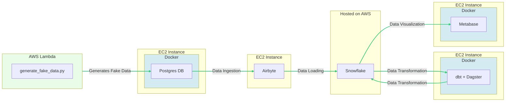

# RetailFlow

## Description

RetailFlow is a comprehensive ELT (Extract, Load, Transform) project designed to simulate the flow of retail sales data for an e-commerce platform. The infrastructure is provisioned and managed on AWS, with each service optimized for its specific role in the pipeline.

The data simulation is handled by a Python script executing within an AWS Lambda function. The generated data is then pushed to a PostgreSQL database instance deployed on AWS EC2.

Data is ingested using Airbyte into the data warehousing solution, Snowflake. Airbyte operates on its own EC2 instance, ensuring dedicated resources for the critical task of data synchronization.

For the transformation phase, we utilize a combination of Dagster and dbt, two cutting-edge tools in the data engineering ecosystem. These tools are deployed on an EC2 instance, allowing for a flexible and powerful transformation process.

The final piece of the pipeline is data visualization, which is handled by Metabase. Running on a dedicated EC2 instance, Metabase provides intuitive and insightful data analytics, allowing stakeholders to extract meaningful conclusions from the data.

The entire system is orchestrated using Terraform, an Infrastructure as Code (IaC) tool that simplifies and standardizes infrastructure deployment. On the application level, we utilize Docker for containerization, ensuring consistency across all stages of development and production.

## Data Infrastructure



<br>

## Project Structure

```
.
├── INSTRUCTIONS.md
├── Makefile
├── README.md
├── assets
│   └── images
├── docker-compose.yml
├── generate
│   ├── Dockerfile
│   └── generate_fake_data.py
├── helpers
│   ├── ascii_graphic.py
│   └── setup.py
├── ingestion
│   └── airbyte
├── requirements.txt
├── storage
│   ├── postgres
│   └── snowflake
├── terraform
│   ├── main.tf
│   ├── output.tf
│   └── variables.tf
├── transformation
│   ├── Dockerfile
│   ├── dagster
│   ├── dbt
│   └── requirements.txt
└── visualization
    └── Dockerfile
```

## Requirements

1. AWS Account
2. AWS CLI (installed and configured)
3. Create a Snowflake account and note down the account_id, username and password
4. Docker
5. docker-compose
6. Terraform

You can install these requirements using the following command: `brew install docker docker-compose awscli terraform`

## Instructions

To see a full list of commands, run `make help` 

1. Run `make env-setup`
2. Run `make initial_config`
3. Run `make infra-up` and wait until you see the 'All Ready' Message
4. Run `port-forwarding-airbyte` and configure the PostgresDB source and the Snowflake destination (this cannot be done programmatically)
5. Run `port-forwarding-metabase` and configure the Snowflake source (this cannot be done programmatically)
6. Explore the remainder of the project by running `port-forwarding-dbt`, `ssh-postgres`, `port-forwarding-dagster`, `open-snowflake` or `print-lambda` to interact with the ec2 instances (port-forwarding, ssh, information, etc.)
7. Once you are finished, run `make infra-down`