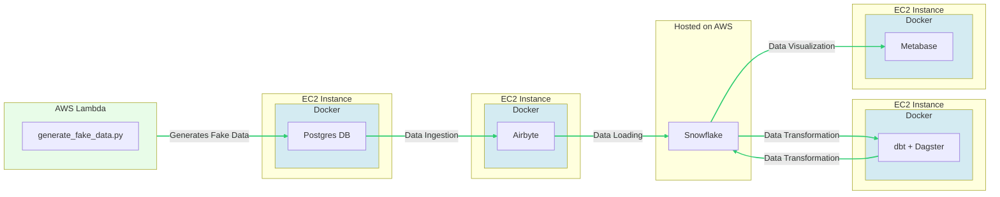

# RetailFlow

## Description

RetailFLow is an end-to-end ELT data engineering project that aims to generate fake retail sales data for an e-commerce store using a Python script on AWS Lambda, push it to a PostgreSQL DB running on an EC2 instance, ingest it into Snowflake using Airbyte also running on an EC2 instance, orchestrate and perform the data transformations using Dagster and dbt also running on its own EC2 instance, and visualize the data using Metabase also running on its own EC2 instance. This project will be deployed on AWS infrastructure using Terraform and managed on the application level by Docker and AWS ECS.

## Data Infrastructure



<br>

## Project Structure

```
.
├── Makefile
├── README.md
├── assets
│   └── images
├── docker-compose.yml
├── generate
│   └── generate_fake_data.py
├── ingestion
│   └── airbyte
├── retailflow_venv
├── storage
│   ├── postgres
│   └── snowflake
├── terraform
│   ├── compute.tf
│   ├── db.tf
│   └── variables.tf
├── transformation
│   ├── dagster
│   ├── dbt
│   └── dockerfile
└── visualization
    └── dockerfile
```

## Additional Tasks

- Collect Airbyte logs in CloudWatch
- Add Linting with sqlfluff