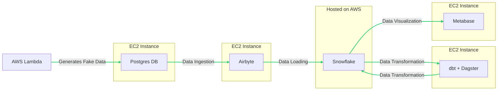

# RetailFlow

## Description

RetailFLow is an end-to-end ELT data engineering project that aims to generate fake retail sales data for an e-commerce store, ingest it into Snowflake using Airbyte, orchestrate and perform the data transformations using Dagster and dbt, and visualize the data using Metabase. This project will be deployed on AWS infrastructure using Terraform.

## Data Infrastructure



<br>

## Project Structure

```
.
.
├── INSTRUCTIONS.md
├── LICENSE
├── Makefile
├── README.md
├── assets
│   └── images
├── env
├── generate
│   └── generate_fake_data.py
├── ingestion
├── requirements.txt
├── retailflow_venv
├── terraform
│   └── main.tf
├── transformation
│   ├── dagster_dags
│   └── dbt
└── visualization
```

## Additional Tasks

- Collect Airbyte logs in CloudWatch
- Add Linting with sqlfluff
- Dockerize everything